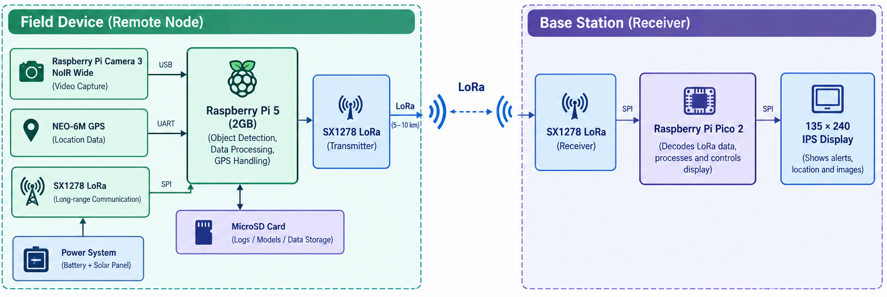

<div align="center">

# WildLife AI

</div>


## Introduction

WildLife AI is a prototype edge-computing system for monitoring remote forest environments. It uses computer vision on a Raspberry Pi 5 to identify objects or activities of interest, obtains the monitoring node's geographic position through a GPS module, and transmits a compact alert over a LoRa link.

The receiving station is based on a Raspberry Pi Pico 2. It receives the alert and presents the detected object, confidence value, geographic coordinates, and communication status on an IPS display. Detection is performed locally so that the system does not require continuous internet access or transmission of camera footage to a cloud service.

## Project Objectives

The system is intended to:

- detect selected objects in camera frames;
- associate detections with GPS coordinates;
- transmit detection data over a long-range, low-bandwidth radio link; and
- present received alerts at a separate monitoring station.

The project is intended for research and prototyping. It must not be treated as a certified safety, security, or emergency-response system.

## System Architecture

The system consists of two nodes.

The following diagram illustrates the connection between the remote monitoring node and the receiving station.



_Figure 1. System architecture of the WildLife AI monitoring and receiving nodes._

### Remote Monitoring Node

The remote node uses the following components:

- Raspberry Pi 5 (2 GB) for application execution and AI inference;
- Raspberry Pi Camera 3 NoIR for image acquisition;
- an object-detection model, currently represented by `yolov8n.pt`;
- NEO-6M GPS module for position acquisition; and
- SX1278 LoRa module for alert transmission.

The remote node captures images, performs inference, reads the GPS position when required, creates a detection message, and transmits the message through LoRa.

### Receiving Node

The receiving node uses the following components:

- Raspberry Pi Pico 2;
- SX1278 LoRa module; and
- 135 x 240 colour IPS display.

The receiving node obtains LoRa packets, processes the received fields, and updates the display with the available detection and status information.

## Detection and Communication Workflow

The expected operational sequence is:

1. The camera provides an image frame.
2. The Raspberry Pi 5 processes the frame and runs object detection.
3. If an object of interest is identified, the application obtains the current GPS position.
4. The application creates a detection message containing the object type, confidence value, latitude, longitude, and alert status.
5. The SX1278 transmitter sends the message over the LoRa link.
6. The Raspberry Pi Pico 2 receives and processes the message.
7. The receiving station displays the received information.

An example message is:

```text
OBJECT=HUMAN
CONF=0.91
LAT=XX.XXXX
LON=XX.XXXX
STATUS=ALERT
```

The exact message format and radio settings are defined by the implementation in the source files and receiver firmware.

## Hardware Requirements

| Component                  | Purpose                                      |
| -------------------------- | -------------------------------------------- |
| Raspberry Pi 5             | Edge processing and application execution    |
| Raspberry Pi Camera 3 NoIR | Image acquisition                            |
| SX1278 LoRa modules        | Wireless communication between the two nodes |
| NEO-6M GPS module          | Geographic position acquisition              |
| Raspberry Pi Pico 2        | Receiving station controller                 |
| 135 x 240 IPS display      | Alert and status presentation                |

The camera must be connected to the Raspberry Pi 5 through the CSI interface. The GPS module must be connected to the UART interface configured by the application. The LoRa modules must use compatible frequency, spreading factor, bandwidth, coding rate, sync word, and other radio parameters.

## Software Requirements

The project contains Python programs for the Raspberry Pi and an Arduino-compatible receiver program for the Raspberry Pi Pico 2. Python dependencies are listed in `requirements.txt`.

The following software is required for the Raspberry Pi implementation:

- Python 3;
- the packages listed in `requirements.txt`;
- Raspberry Pi camera support, including `rpicam-hello`; and
- access to the connected camera, GPS, and LoRa hardware.

The receiver requires the libraries and board configuration appropriate for the selected Raspberry Pi Pico 2 display and LoRa hardware.

## Installation

Clone the repository and enter its directory:

```bash
git clone https://github.com/Gavinduachintha/WildLife-AI.git
cd WildLife-AI
```

Create and activate a Python virtual environment:

```bash
python3 -m venv .venv
source .venv/bin/activate
```

Install the Python dependencies:

```bash
pip install -r requirements.txt
```

On Windows, activate the virtual environment with:

```powershell
.venv\Scripts\Activate.ps1
```

The hardware-dependent portions of the project are intended to run on the configured Raspberry Pi system. The virtual environment alone does not provide access to the camera, GPS, or LoRa hardware.

## Hardware Verification

Verify that the Raspberry Pi camera is available before starting the application:

```bash
rpicam-hello
```

Verify that the GPS module is connected to the configured UART interface and that it provides serial position data. Verify that both LoRa modules use matching radio settings and that the antenna and power configuration are suitable for the deployment.

## Running the Application

Start the main application on the Raspberry Pi 5 with:

```bash
python main.py
```

The application initializes the camera, GPS, LoRa interface, and detection model before entering the detection loop. The appropriate receiver firmware must be loaded onto the Raspberry Pi Pico 2 for alerts to be displayed.

## Repository Structure

The current repository contains:

```text
WildLifeAI/
├── Assets/
│   └── system_architecture.png
├── PCB Project/
│   ├── LoRa Tracker.kicad_pcb
│   ├── LoRa Tracker.kicad_pro
│   └── LoRa Tracker.kicad_sch
├── Receiver/
│   └── lora_rx_final_working_with_display.ino
├── cam2.py
├── cam3.py
├── camera1.py
├── detect.py
├── detect1.py
├── Final.py
├── gpsTest.py
├── main.py
├── requirements.txt
├── yolov8n.pt
└── README.md
```

Some Python files are experimental or provide separate hardware tests. `main.py` is the documented application entry point. The receiver firmware is located in `Receiver/`, and the KiCad design files are located in `PCB Project/`.

## Communication Range

The project uses a target communication range of approximately 5 to 10 km. This is not a guaranteed operating distance. Actual performance depends on antenna configuration, terrain, vegetation, obstacles, transmit power, frequency, spreading factor, bandwidth, coding rate, and receiver sensitivity.

## Limitations

Detection performance depends on the model, training data, lighting, camera position, object distance and size, occlusion, and environmental conditions. The system may produce false positives or false negatives.

LoRa is a low-bandwidth communication method and is appropriate for compact detection messages rather than continuous video. Communication reliability and range must be tested under the conditions of the intended deployment.

The project is a prototype. Hardware compatibility, electrical safety, radio compliance, data protection, and operational reliability must be evaluated before any field deployment.

## Author

Gavindu Achintha

## Contact

For project-related questions or contributions, contact the author through [GitHub](https://github.com/Gavinduachintha).

## License

The project license has not been specified in the current repository.

---

<p align="center">
	<strong>WildLife AI</strong><br>
	Edge monitoring for remote environments<br>
	<a href="https://github.com/Gavinduachintha">Gavindu Achintha on GitHub</a>
</p>
